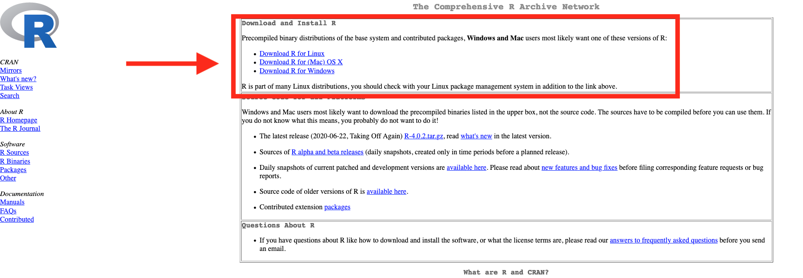
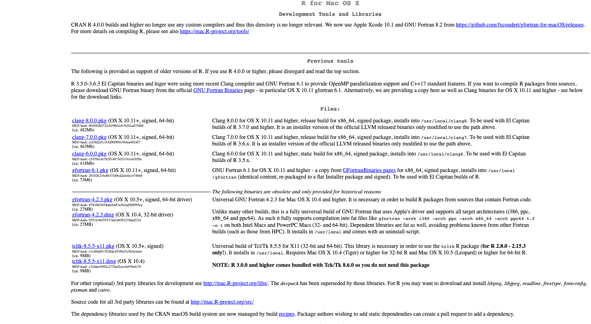
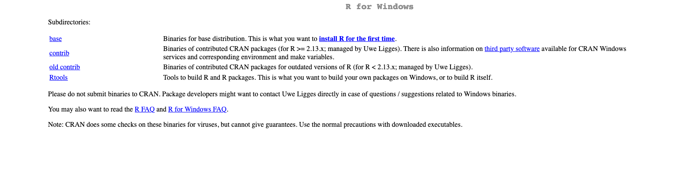
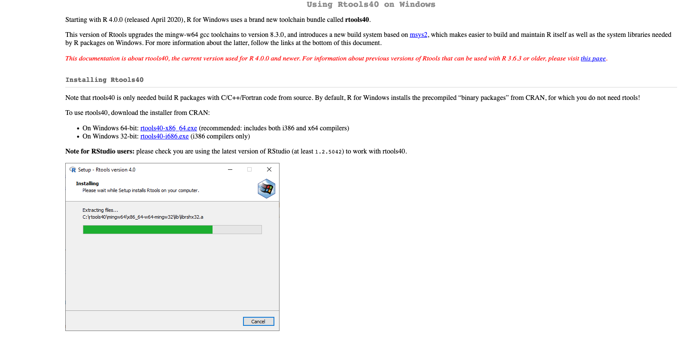

by Rodrigo Esteves de Lima Lopes *University of Campinas*  rll307\@unicamp.br](mailto:rll307@unicamp.br)

------------------------------------------------------------------------
# R - Installing R

## Introduction

[R](https://www.r-project.org/) is a statistical analysis software. It was not initially though for language studies; however, it has proved to be quite useful for such a field of inquiry. [R](https://www.r-project.org/) is object-oriented: each time we load a package, there is a new pre-defined set of  functions. We will not create packages, but we will use those and their functions to do our tutorials. Here [R](https://www.r-project.org/) will serve us to analyse and plotting data. We know that R can do much more, but that will be our cup of tea for this introduction.

## Download R

Go to [R](https://www.r-project.org/) website and download the latest version of R to your computer. There are binary versions for macOS, Linux and Windows. I do not have a Windows computer since 1999, so probably I will not be able to help you much if you have a Windows-specific issue.

After you install R, I would strongly suggest you go to download and install some tools which might aid us to install some packages. If you are using a macOS computer, scroll to the bottom and click on *tools*, install the following software:

-   clang
-   gfortran
-   tcltk

If you are using Windows, download and install rtools.exe.

