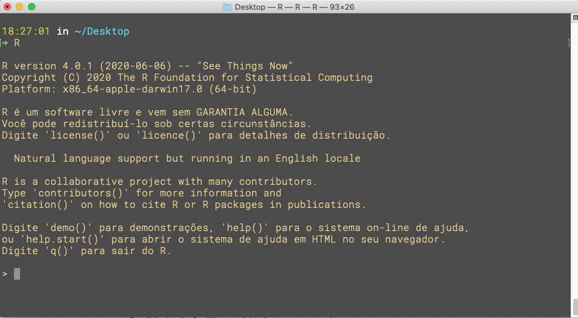
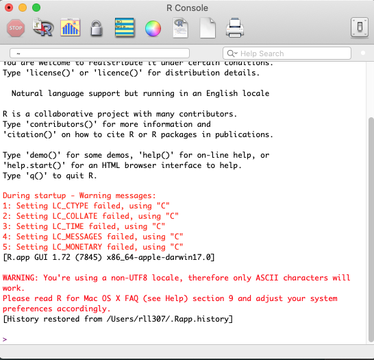
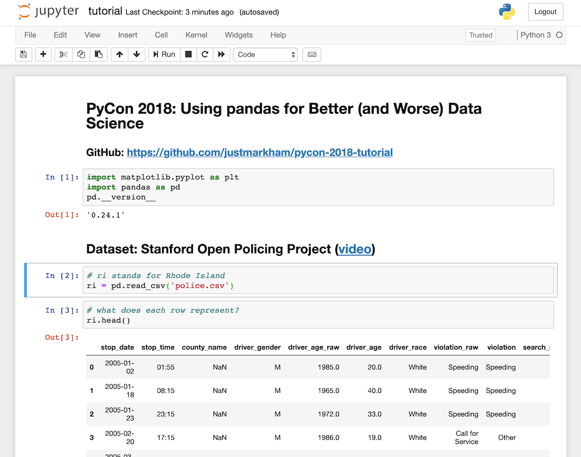

By Rodrigo Esteves de Lima Lopes *University of Campinas* [rll307\@unicamp.br](mailto:rll307@unicamp.br)

------------------------------------------------------------------------
# IDE (Integrated Development Environment)

R is a fascinating piece of software, but it does not bring much of an interface for its users. As we can see in the picture below, R is not very friendly:

-   There is no syntax highlighting
-   There is no visual indication of what is in our computer's memory
-   There is no place to write our scripts and run them.

Mostly, it is a blank window with a cursor and some technical information. There is another interface, also native, that ships with some distributions of R (see image below), but it is equally unfriendly.

This is why most R users need an *Integrated Development Environment*, or IDE for short. This sort of application makes it possible for users to access many functions that are hidden inside R. Other advantages are the syntax highlighting and easier package installation and a richer interface. The interface takes us to a more comfortable navigation, as a 'click on' action might now replace some commands.

Here I will do a brief review of some of the IDEs available. During our workshop, please, feel free to use one you see fit.

Please note that R has to be installed before this step.

## IDEs for coding

### RStudio

[RStudio](https://rstudio.com/) is a very powerful and popular IDE that does more than just R coding (primary function). It also offers:

-   Python editor
    -   Python codes and files
-   Markdown editor
    -   A text editor for markup languages
-   Rmarkdown editor
    -   A text editor that allows exporting to several formats (HTML, PDF, DOCX etc.)
-   Visualisation of functions
-   Visualisation of plots and other outcomes
-   Visualisation of data variables within the IDE
-   Package management (install, uninstall, load)
-   Basic tutorials
-   Basic File Manager
-   Shell (terminal) integration

The installation is quite simple, as well:

1.  Go to [RStudio](https://rstudio.com/) website
2.  Click in products/Rstudio
3.  Scroll down, click on Rstudio Desktop
4.  Download *Open Source Edition* according to your system.
    -   Please note that we go for the free version

RStudio is my IDE of choice. There is a massive community of RStudio users, please, access [RStudio](https://rstudio.com/) website for further information.

### Pycharm

[PyCharm](https://www.jetbrains.com/pycharm/) is an IDE initially developed for Python. However, it brings a friendly [R plugin support](https://www.jetbrains.com/help/pycharm/r-plugin-support.html). It offers all function that RStudio does, but with a little difference, [PyCharm](https://www.jetbrains.com/pycharm/) is project-oriented. It means that you have to create a code project and assign it to a directory in order to make it work. In practical terms, it creates a virtual environment inside the designated directory, using a little bit more of space and it does not run files which are not related to a project.

The only reason I do not use [PyCharm](https://www.jetbrains.com/pycharm/) in a regular basis is that I have had some difficulties in its support for Rmarkdown.

The installation is quite simple, as well:

1.  Go to [PyCharm](https://www.jetbrains.com/pycharm/) website
2.  Click download
3.  Download community (free edition)

After installing PyCharm, you will have to install the R language Plugin:

1.  Open PyCharm software
2.  Open Settings/Preferences/Plugins
3.  Search for "R Language for IntelliJ" and install it
4.  Restart PyCharm

If you would like some specific tutorials:

1.  PyCharm R plugin [page](https://www.jetbrains.com/help/pycharm/r-plugin-support.html)
2.  Installation of [Pycharms plugins](https://www.jetbrains.com/help/pycharm/managing-plugins.html)

## IDEs for Studying

There are some IDEs that are meant to write notebooks. Mostly for publishing or for keeping notes on codes.

## RStudio

RStudio might be useful for creating notebooks for studying and further publishing of code. However, to use such a feature, you will have to learn some markdown. Markdown is a language for text formatting quite simple and effective. This tutorial is written in Rmarkdown, a variety of markdown applied to R.

Please, for further information on the topic:

-   [Rmarkdown web page](https://rmarkdown.rstudio.com/)
-   [R notebooks](https://rmarkdown.rstudio.com/lesson-10.html)

You will see that Rmarkdown can write a series of complex documents, using the very same platform we use for research.

### Jupyter notebooks

[Jupyter Notebook](https://jupyter.org/) is an IDE for note-taking and code publishing. It works as an editor in your browser and creates HTML outputs which might have consulted or changed latter. It works with a variety of programming languages.

The installation of [Jupyter](https://jupyter.org/) is a bit complex, but the tools might worth the effort.

1.  Download and install the latest version of [Python](https://www.python.org/) for your system
2.  Open a terminal (yes, we are going to use it for installing and starting the programme latter)
3.  Run `Python -m pip install --upgrade`
4.  Run `pip install jupyterlab`
5.  Run `jupyter notebook` to start [Jupyter](https://jupyter.org/) for the first time
6.  Open RStudio
7.  Create a new script, type these two lines:
    -   `install.packages('IRkernel')` - Installs a package for integration
    -   `IRkernel::installspec(user = FALSE)` - Makes a R Kernel available for Jupiter's system
8.  Back to the terminal, run `jupyter notebook` and start using it.
    -   Click on New/R and get a new notebook

An excellent tutorial might be found [here](https://dzone.com/articles/using-r-on-jupyternbspnotebook).
