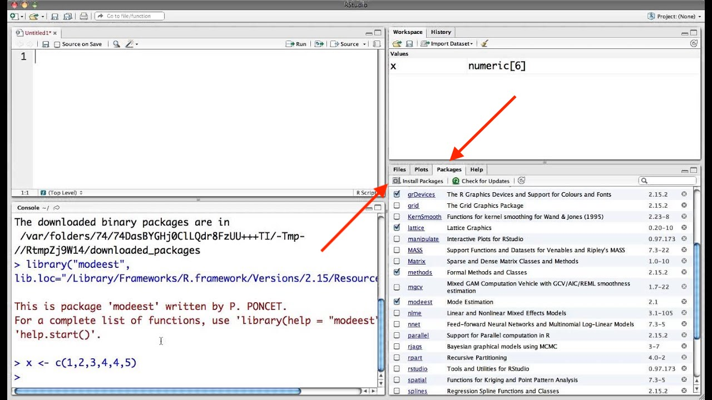
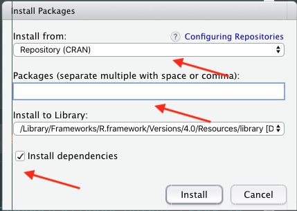
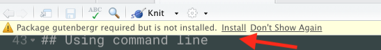

by Rodrigo Esteves de Lima Lopes\
*Campinas State University*\
[rll307\@unicamp.br](mailto:rll307@unicamp.br)

------------------------------------------------------------------------

# Install using your IDE

For installing the package using you IDE support, you will have to look
for the tab `packages`. Then you click on it. You will see a list of
your system's packages, the ones with the *tick* are loaded. To load a
package from IDE with no code, just *tick* package. To install a
package, click on install packages, type the name of the package and the
IDE will do the job for you. Please, do not forget to choose *install
dependencies*, so everything runs smoothly. The images bellow show the
process.



{width="50%"}

# Using command line

Go to console and type:

``` r
install.packages('gutenbergr', dependencies=TRUE)
```

If you need some help in this command, just type in your console:

``` r
?install.packages()
```

This procedure is standard in all R commands. If you type **?** followed
by a command, it will display help on that command automatically.

# If you are lucky

If you are lucky enough a message might pop up at the top of your script
editor. This is RStudio asking you to install the package, just click on
it


