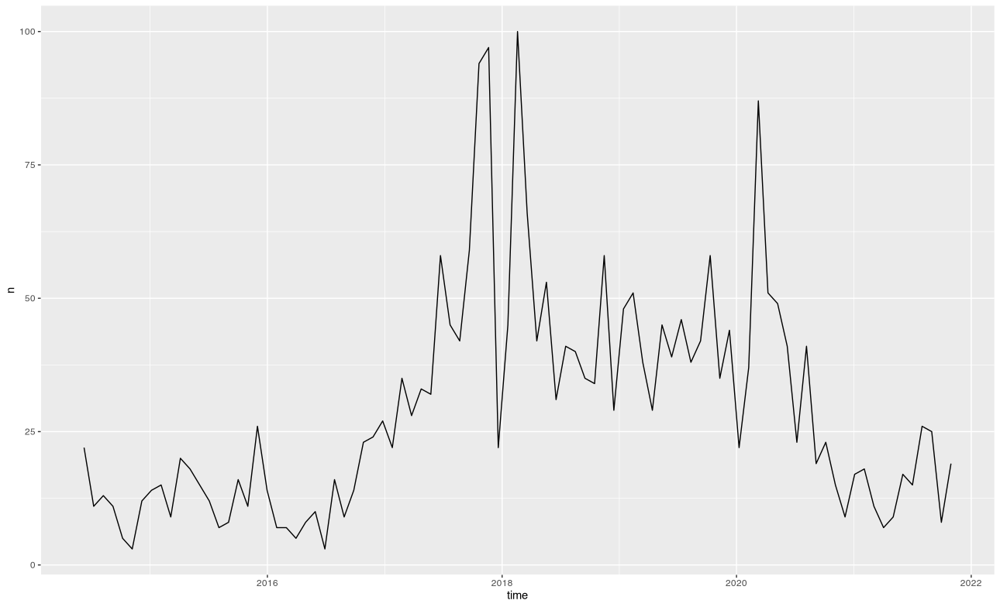
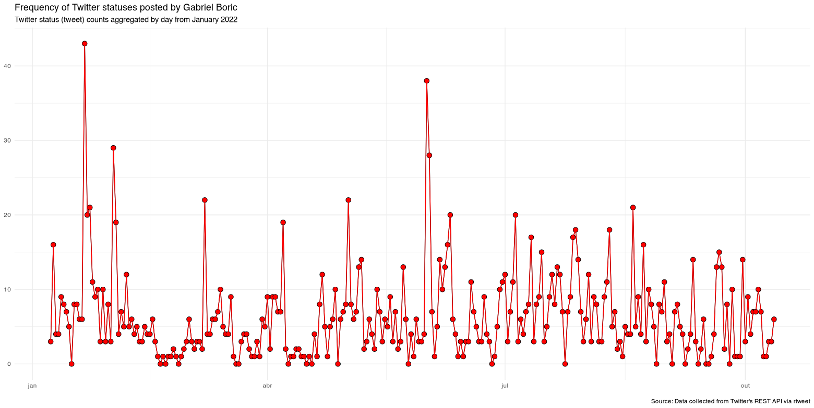
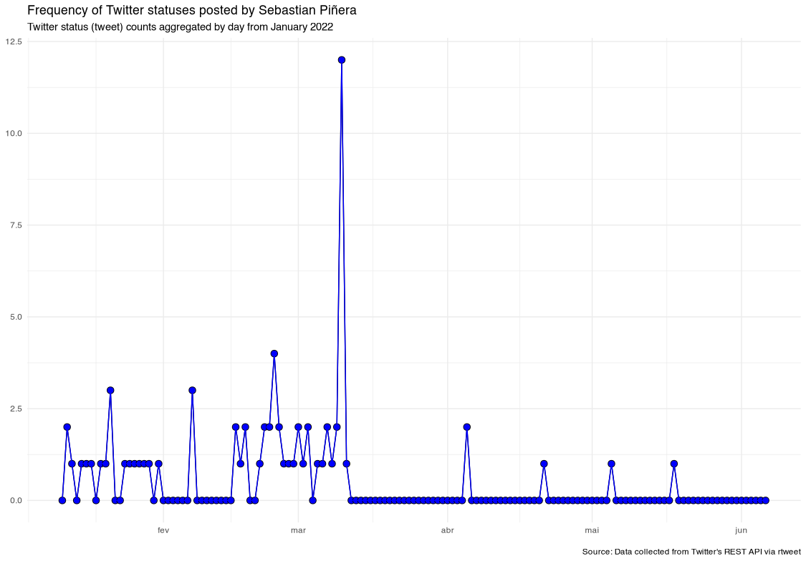

By Rodrigo Esteves de Lima Lopes *University of Campinas* [rll307\@unicamp.br](mailto:rll307@unicamp.br)

------------------------------------------------------------------------

# My first Twitter data scraping

# Introduction

Our main objective is to have a first contact with a data scraping package. In this case, `rtweet`. Twitter has been one of the oldest surviving social media, and it also has been an important source for data in the last few years. But please, take into account that the data we collect might be influenced by a number of factors:

1.  Twitter's algorithm is known to change the results depending of our location
2.  A different kind of account (professional, personal or premium) offers different results
3.  Our Internet band might influence the results

## What are we going to need

1.  A valid [Twitter](https://twitter.com/) account
2.  The Package [rtweet](https://github.com/ropensci/rtweet) for data scraping

### Responsible data use

Please, keep in mind that any data scraping should be done in accordance to Twitter's [terms and conditions](https://developer.twitter.com/en/developer-terms/more-on-restricted-use-cases).

# Scraping some data

Loading the package:

``` r
library(rtweet)
auth_setup_default()
library(ggplot2)
library(dplyr)
options(scipen=999)
```

## Twitter locations

First we are going to get some insights on what is trending in our location. So we start by checking which are the locations available:

``` r
all.trends <- trends_available()
```

If we have a close look, `my.trends <- trends_available()` delivers a table with numbers, cities and countries. I am in Santiago - Chile, so I will try to get the trends available there. If we look at the table, Santiago's ID is `349859`. So we will get the trends by using this ID.

``` r
Santigo.trends <- get_trends(woeid = 349859)
```

Again we have a table. It is a snapshot of Twitter at the moment data were collected, it tends to change, sometimes, by the minute.

## Getting some tweets

In my data, the term **18DeOctubre** called my attention, so I will search for it. There are two ways to do so:

1.  `stream_tweets()`: searches tweets for a given period of time.
2.  `search_tweets()`: searches tweets until it gets specified number of tweets.

### stream_tweets

-   **Advantages**: it collects as much tweets as possible in a given period of time.
-   **Disadvantages**: *1)* It tends to get connection and parsing errors when we search for long periods of time. There is a function called recover_stream.R, written by [Johannes Gruber](https://github.com/JBGruber) (who we are quite deeply thankful) and available [here](https://gist.github.com/JBGruber), that might sort out the problem sometimes. However, if our file is too damaged, it may not work. *2)* This command may have some problems due to firewall policies or temporary unavailability of Twitter's API.

Let us make some search using `stream_tweets`:

``` r
stream_tweets('18DeOctubre', 
                       timeout = 60, #in seconds
                       file_name='t01', # it saves a the tweets in a file
                       parse=FALSE)
```

Now we will need the following commandto load this tweets:

``` r
my.tweets <- parse_stream("t01")
```

If we look at this file, there is a lot of possible variables to explore, over 90 columns with a lot of information regarding our tweets.

### search_tweets()

-   **Advantages**: always returns nice parsed files.
-   **Disadvantages**: if you do not have a researcher or premium account, number of instances might be limited.

Due to time, we will search for some tweets only:

``` r
my.Tweets2 <- search_tweets(
  "18DeOctubre", n = 1000, include_rts = TRUE)
```

Let us get the timeline form a politician:

``` r
gabrielboric <- get_timeline("gabrielboric", n = 1000)
```

Let us get his followers

``` r
gabrielboric.flw <- get_followers("gabrielboric", n = 1000)
```

Now let us get some information regarding some of those followers

``` r
gabrielboric.flw2 <- gabrielboric.flw[1:100,]
info <- lookup_users(gabrielboric.flw2$from_id)
```

Getting some users who have tweeted about our search term:

``` r
users <- search_users("18DeOctubre", n = 1000)
```

# Timelines

Let us get the timelines for the some possible candidates in the next Brazilian's elections:

``` r
gabrielboric <- get_timeline("gabrielboric", n = 3000)
sebastianpinera <- get_timeline("sebastianpinera", n = 3000)
```

Our next step is identifying the origin of each president:

``` r
gabrielboric$screen_name <- "gabrielboric"
sebastianpinera$screen_name <- "sebastianpinera"
```

Merging all data, so I can save and use it

Now let us save our data outside R, if I want to analyse the texts in other software:

``` r

presidets.save  <- data.frame(lapply(presidents, as.character), stringsAsFactors=FALSE)
write.csv(presidets.save, "presidents.csv")
```

# Now let us plot the frequency

The basic, one plot for all:

``` r
gabrielboric %>% ts_plot("month", trim = 7L)
sebastianpinera %>% ts_plot("month", trim = 7L)
```




`ts_plot()` is part of `rtweet`. It "borrows" some elements from `ggplot2` in order to plot frequency of tweets as time series. It is possible to make the visual representation a bit more sophisticated by providing multiple text-based filters to subset data. It is also possible to plot multiple time series.

As we can see, this image does not give us much information about the tweets. So let us make the plot a bit more complex, now considering each candidate:

**Gabriel Boric**

``` r
presidents %>%
  dplyr::filter(created_at > "2022-01-01") %>%
  dplyr::filter(screen_name == "gabrielboric") %>%
  ts_plot("day", trim = 7L) +
  ggplot2::geom_point(color = "black",shape=21,fill="red",size = 3) +
  ggplot2::geom_line(color = "red")+
  ggplot2::theme_minimal() +
  ggplot2::labs(
    x = NULL, y = NULL,
    title = "Frequency of Twitter statuses posted by Gabriel Boric",
    subtitle = "Twitter status (tweet) counts aggregated by day from January 2022",
    caption = "\nSource: Data collected from Twitter's REST API via rtweet"
  )
```



**Sebastian Piñera**

``` r
presidents %>%
  dplyr::filter(created_at > "2022-01-01") %>%
  dplyr::filter(screen_name == "sebastianpinera") %>%
  ts_plot("day", trim = 7L) +
  ggplot2::geom_point(color = "black",shape=21,fill="blue",size = 3) +
  ggplot2::geom_line(color = "blue")+
  ggplot2::theme_minimal() +
  ggplot2::labs(
    x = NULL, y = NULL,
    title = "Frequency of Twitter statuses posted by Sebastian Piñera",
    subtitle = "Twitter status (tweet) counts aggregated by day from January 2022",
    caption = "\nSource: Data collected from Twitter's REST API via rtweet"
  )
```



In the commands above, a number of filters and new criteria changed the way data was represented. In a nutshell we:

1.  chose a single candidate
2.  set a data form the timeline to start
3.  set a colour for each candidate
4.  set the size

Now, let us plot all the presidents in a single command:

``` r
presidents %>%
  dplyr::filter(created_at > "2022-01-01") %>%
  dplyr::group_by(screen_name) %>%
  ts_plot("day", trim = 15L) +
  ggplot2::geom_point(size = 3, aes(shape = factor(screen_name),color = factor(screen_name))) +
  ggplot2::theme_minimal() +
  ggplot2::theme(
    legend.title = ggplot2::element_blank(),
    legend.position = "bottom",
    plot.title = ggplot2::element_text(face = "bold")) +
  ggplot2::labs(
    x = NULL, y = NULL,
    title = "Frequency of Twitter statuses posted by Chilean Presidentss",
    subtitle = "Twitter status (tweet) counts aggregated by date",
    caption = "\nSource: Data collected from Twitter's REST API via rtweet"
  )
```


In a nutshell we:

1.  chose all candidates
2.  grouped the occurrences by screen name
3.  set a data form the timeline to start
4.  set a colour and shape for each candidate
5.  set the size

Which conclusions can we get?
