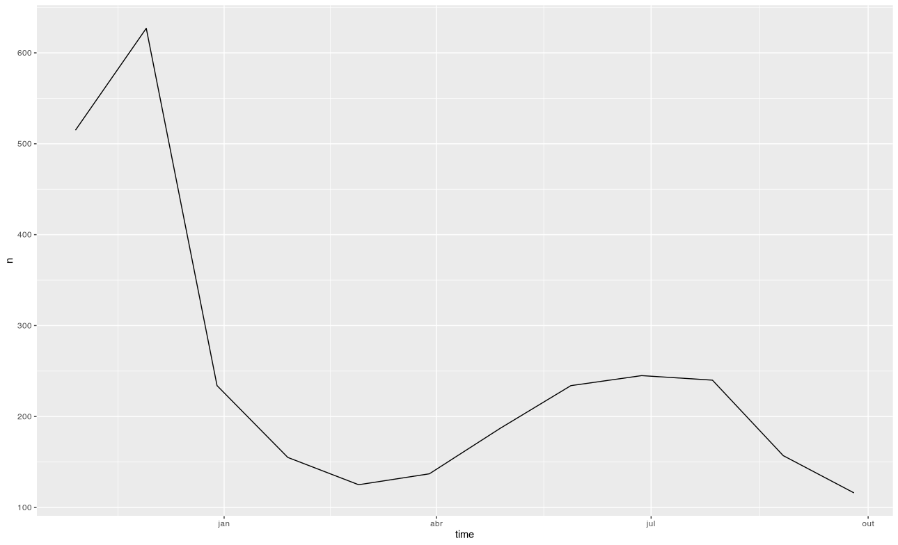
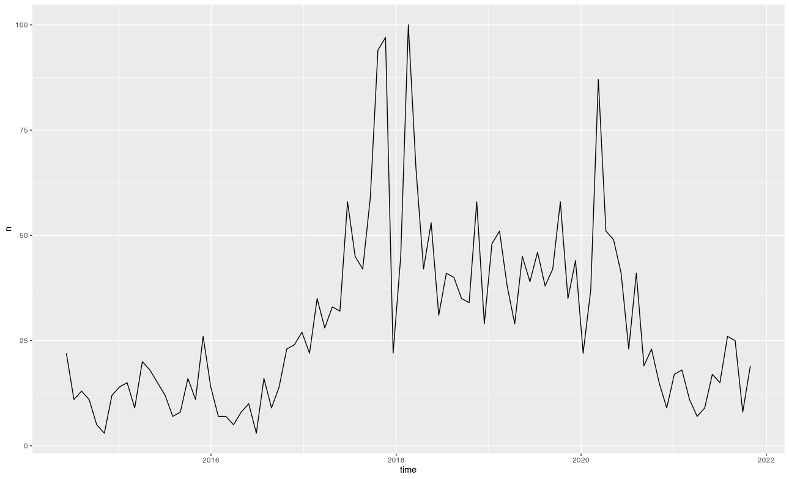
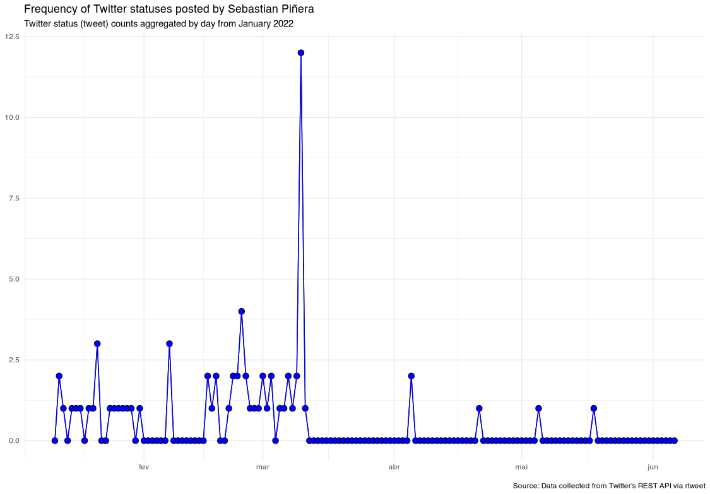
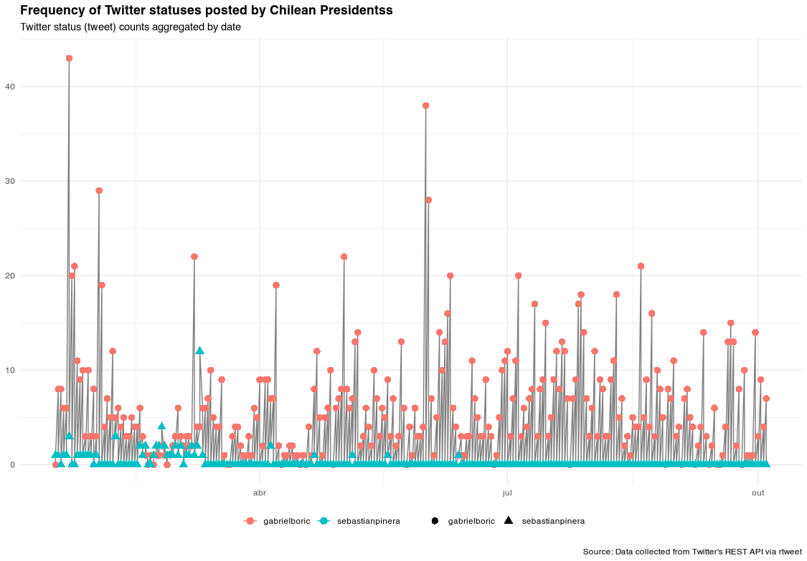

By Rodrigo Esteves de Lima Lopes *Campinas University* [rll307\@unicamp.br](mailto:rll307@unicamp.br)

------------------------------------------------------------------------

# Plotting

# Introduction

Our may objective here is to plot the results we collected last script. The grammar of plotting might be a bit overwhelming, but keep in mind it is just a small introduction.

In this tutorial we use [`ggplot2`](https://ggplot2.tidyverse.org/index.html), a package for plotting in R. Other packages should do the job, but `ggplot2` is the most popular across `R` users. The Package [Dplyr](https://dplyr.tidyverse.org/) might be necessary for data manipulation.

# Now let us plot the frequency

The basic, one plot for all:

``` r
gabrielboric %>% ts_plot("month", trim = 7L)
sebastianpinera %>% ts_plot("month", trim = 7L)
```





`ts_plot()` is part of `rtweet`. It "borrows" some elements from `ggplot2` in order to plots frequency of tweets as time series. It is possible to make the visual representation a bit more sophisticated by providing multiple text-based filters to subset data. It is also possible to plot multiple time series.

As we can see, this image does not give us much information about the tweets. So let us make the plot a bit more complex, now considering each president:

**Sebastian Piñera**

``` r
presidents %>%
  dplyr::filter(created_at > "2022-01-01") %>%
  dplyr::filter(screen_name == "sebastianpinera") %>%
  ts_plot("day", trim = 7L) +
  ggplot2::geom_point(color = "black",shape=21,fill="blue",size = 3) +
  ggplot2::geom_line(color = "blue")+
  ggplot2::theme_minimal() +
  ggplot2::labs(
    x = NULL, y = NULL,
    title = "Frequency of Twitter statuses posted by Sebastian Piñera",
    subtitle = "Twitter status (tweet) counts aggregated by day from January 2022",
    caption = "\nSource: Data collected from Twitter's REST API via rtweet"
  )
```



**Gabriel Boric**

``` r
presidents %>%
  dplyr::filter(created_at > "2022-01-01") %>%
  dplyr::filter(screen_name == "gabrielboric") %>%
  ts_plot("day", trim = 7L) +
  ggplot2::geom_point(color = "black",shape=21,fill="red",size = 3) +
  ggplot2::geom_line(color = "red")+
  ggplot2::theme_minimal() +
  ggplot2::labs(
    x = NULL, y = NULL,
    title = "Frequency of Twitter statuses posted by Gabriel Boric",
    subtitle = "Twitter status (tweet) counts aggregated by day from January 2022",
    caption = "\nSource: Data collected from Twitter's REST API via rtweet"
  )
```


In the commands above, a number of filters and new criteria changed the way data was represented. In a nutshell we:

1.  chose a single candidate
2.  set a data form the timeline to start
3.  set a colour for each candidate
4.  set the size

Now, let us plot all the presidents in a single command:

``` r
presidents %>%
  dplyr::filter(created_at > "2022-01-01") %>%
  dplyr::group_by(screen_name) %>%
  ts_plot("day", trim = 15L) +
  ggplot2::geom_point(size = 3, aes(shape = factor(screen_name),color = factor(screen_name))) +
  ggplot2::theme_minimal() +
  ggplot2::theme(
    legend.title = ggplot2::element_blank(),
    legend.position = "bottom",
    plot.title = ggplot2::element_text(face = "bold")) +
  ggplot2::labs(
    x = NULL, y = NULL,
    title = "Frequency of Twitter statuses posted by Chilean Presidents",
    subtitle = "Twitter status (tweet) counts aggregated by date",
    caption = "\nSource: Data collected from Twitter's REST API via rtweet"
  )
```



In a nutshell we:

1.  chose all candidates
2.  grouped the occurrences by screen name
3.  set a data form the timeline to start
4.  set a colour and shape for each candidate
5.  set the size

Which conclusions can we get?
