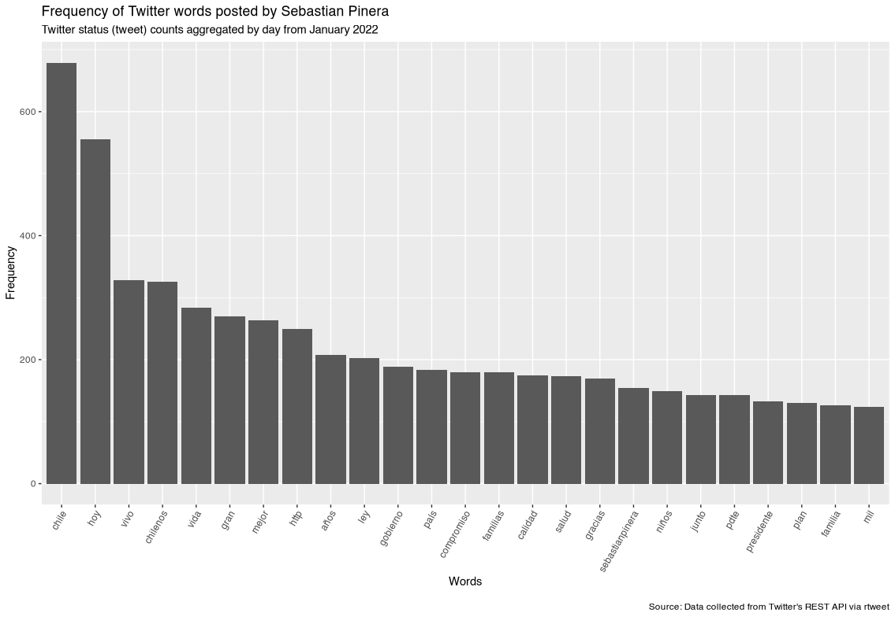
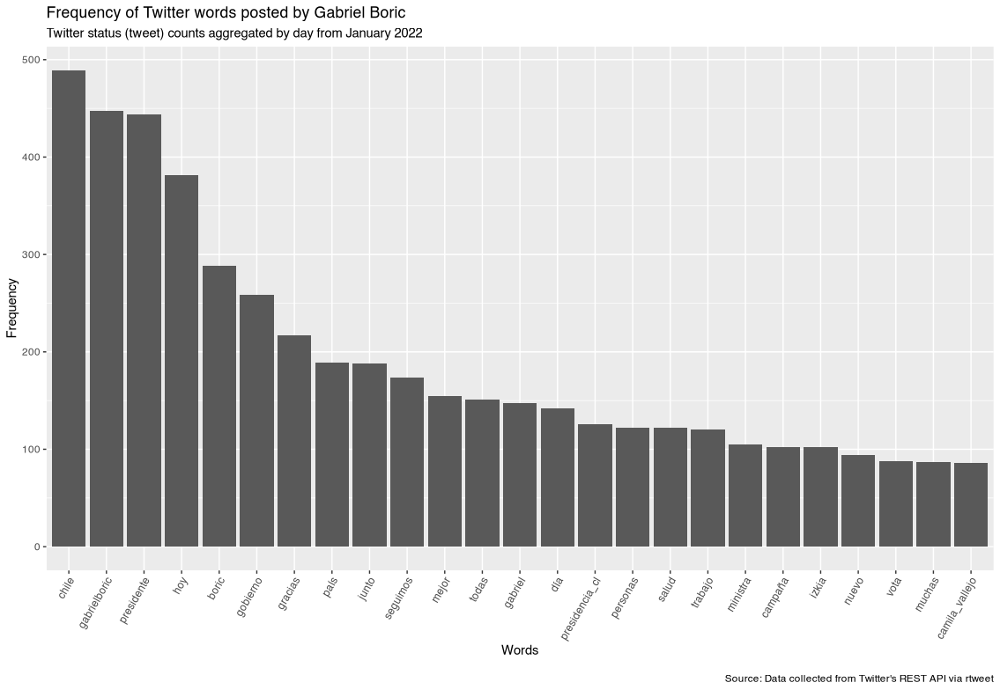

By Rodrigo Esteves de Lima Lopes *University of Campinas* [rll307\@unicamp.br](mailto:rll307@unicamp.br)

------------------------------------------------------------------------

# Comparing Tweets

## Introduction

In this tutorial we will discuss how to make an initial exploration on Twitter textual data. Here we intend to perform an exploratory analysis of the text scraped from each candidates' timeline.

We are going to use the following packages:

-   **dplyr** for data handling
-   **tidytext** for text handling
-   **ggplot2** for plotting

``` r
library(dplyr)
library(tidytext)
library(ggplot2)
```

# Preparing the data

Our first is to create a stopwords list. Here we are going to use one which already exists, provided by `Quanteda`. We save it as a data frame in order to apply it to our tweets later.

``` r
my.stopwords <- data.frame(word = quanteda::stopwords("es"))
```

Now we run the following command for each candidate, so we have three wordlists:

**Boric**

``` r
gabrielboric.w <- gabrielboric %>%
  unnest_tokens(word, text) %>% # separates each word
  count(word, sort = TRUE) %>% # counts each word
  anti_join(my.stopwords, by= "word") %>% # delete stopwords
  mutate(freq = n / sum(n)) %>% # proportion (base 1)
  mutate_at(vars(-matches("word|n")),~ .x * 100)  # translates proportion to base 100
```

Improving the stop word lists and running it again

``` r
my.stopwords <- data.frame(word = c(quanteda::stopwords("es"),"rt","https","http", "t.co","s" ))

gabrielboric.w <- gabrielboric %>%
  unnest_tokens(word, text) %>% # separates each word
  count(word, sort = TRUE) %>% # counts each word
  anti_join(my.stopwords, by= "word") %>% # delete stopwords
  mutate(freq = n / sum(n)) %>% # proportion (base 1)
  mutate_at(vars(-matches("word|n")),~ .x * 100)  # translates proportion to base 100
```

**Sebastian Pinera**

``` r
sebastianpinera.w <- sebastianpinera %>%
  unnest_tokens(word, text) %>% # separates each word
  count(word, sort = TRUE) %>% # counts each word
  anti_join(my.stopwords, by= "word") %>% # delete stopwords
  mutate(freq = n / sum(n)) %>% # proportion (base 1)
  mutate_at(vars(-matches("word|n")),~ .x * 100)  # translates proportion to base 100

# improving the stop word lists

my.stopwords <- data.frame(word = c(quanteda::stopwords("es"),"rt","https","http", "t.co","s","q", 'x' ))

sebastianpinera.w <- sebastianpinera %>%
  unnest_tokens(word, text) %>% # separates each word
  count(word, sort = TRUE) %>% # counts each word
  anti_join(my.stopwords, by= "word") %>% # delete stopwords
  mutate(freq = n / sum(n)) %>% # proportion (base 1)
  mutate_at(vars(-matches("word|n")),~ .x * 100)  # translates proportion to base 100
  
```

The next set of commands will plot the wordlists, for more information on that, please refer to [08_plotting](08_plotting.md)

**Sebastian Piñera**

``` r
sebastianpinera.w  %>% 
  slice(1:25) %>% 
  ggplot(aes(x = reorder(word, n, function(n) -n), y = n)) + 
  geom_bar(stat = "identity") + 
  theme(axis.text.x = element_text(angle = 60, hjust = 1)) +
  labs(
    x = "Words", y = "Frequency",
    title = "Frequency of Twitter words posted by Sebastian Pinera",
    subtitle = "Twitter status (tweet) counts aggregated by day from January 2022",
    caption = "\nSource: Data collected from Twitter's REST API via rtweet"
  )
```



**Gabriel Boric**

``` r
gabrielboric.w   %>% 
  slice(1:25) %>% 
  ggplot(aes(x = reorder(word, n, function(n) -n), y = n)) + 
  geom_bar(stat = "identity") + 
  theme(axis.text.x = element_text(angle = 60, hjust = 1)) +
  labs(
    x = "Words", y = "Frequency",
    title = "Frequency of Twitter words posted by Gabriel Boric",
    subtitle = "Twitter status (tweet) counts aggregated by day from January 2022",
    caption = "\nSource: Data collected from Twitter's REST API via rtweet"
  )
```


