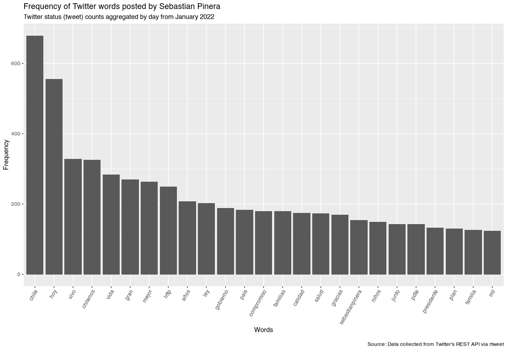
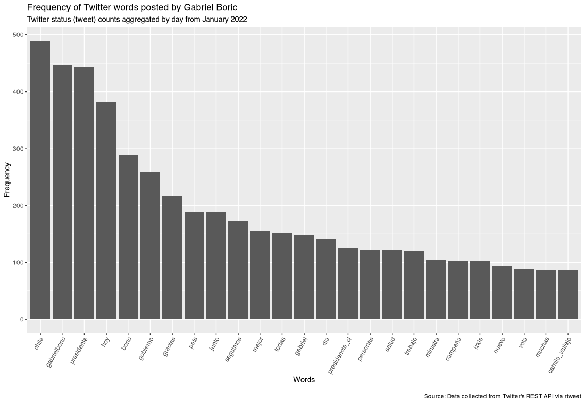

By Rodrigo Esteves de Lima Lopes *Campinas University* [rll307\@unicamp.br](mailto:rll307@unicamp.br)

------------------------------------------------------------------------

# Plotting

# Introduction

Our may objective here is to plot the results we collected last script. The grammar of plotting might be a bit overwhelming, but keep in mind it is just a small introduction.

In this tutorial we use [`ggplot2`](https://ggplot2.tidyverse.org/index.html), a package for plotting in R. Other packages should do the job, but `ggplot2` is the most popular across `R` users.

We will plot a bar chart for each candidate

# Sebastian Piñera

``` r
sebastianpinera.w  %>% 
  slice(1:25) %>% 
  ggplot(aes(x = reorder(word, n, function(n) -n), y = n)) + 
  geom_bar(stat = "identity") + 
  theme(axis.text.x = element_text(angle = 60, hjust = 1)) +
  labs(
    x = "Words", y = "Frequency",
    title = "Frequency of Twitter words posted by Sebastian Pinera",
    subtitle = "Twitter status (tweet) counts aggregated by day from January 2022",
    caption = "\nSource: Data collected from Twitter's REST API via rtweet"
  )
```



# Gabriel Boric

``` r
gabrielboric.w   %>% 
  slice(1:25) %>% 
  ggplot(aes(x = reorder(word, n, function(n) -n), y = n)) + 
  geom_bar(stat = "identity") + 
  theme(axis.text.x = element_text(angle = 60, hjust = 1)) +
  labs(
    x = "Words", y = "Frequency",
    title = "Frequency of Twitter words posted by Gabriel Boric",
    subtitle = "Twitter status (tweet) counts aggregated by day from January 2022",
    caption = "\nSource: Data collected from Twitter's REST API via rtweet"
  )
```


