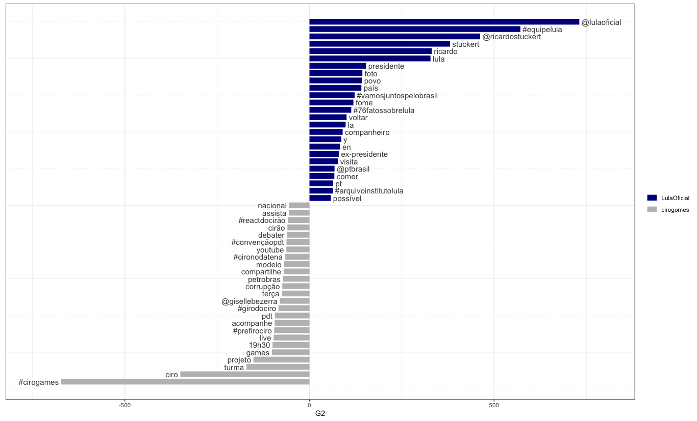
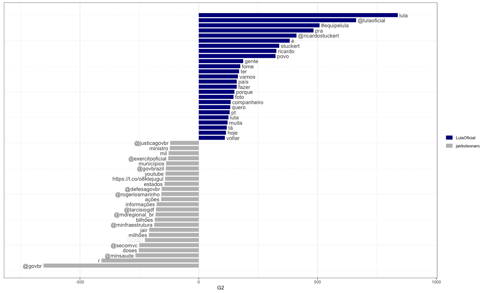
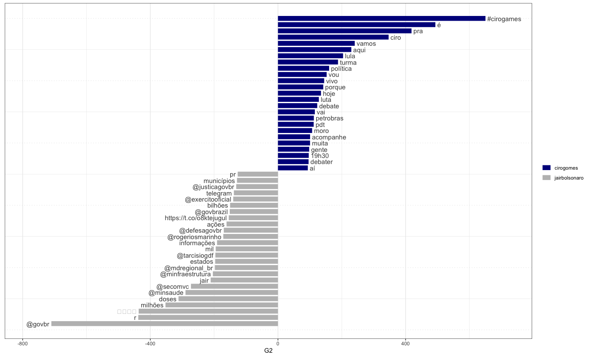

By Rodrigo Esteves de Lima Lopes *University of Campinas* [rll307\@unicamp.br](mailto:rll307@unicamp.br)

------------------------------------------------------------------------

# Quanteda

# Introduction

[Quanteda](https://quanteda.io/) is a package for managing and analyse text quantitatively. It is quite easy to use and will bring us a number of interesting functions.

## You will need:

1.  The package [`Quanteda`](https://quanteda.io/), `quanteda.textplots` and `quanteda.textstats`, which can be installed using [RStudio](http://www.sthda.com/english/wiki/installing-and-using-r-packages)
2.  The package `rtweet`, which we installed for our [first Twitter tutorial](05_rtweet_E1).
3.  `Ggplot2` for viewing some graphics, which we installed for our [first Twitter tutorial](05_rtweet_E1).

``` r
# Running the packages
library(quanteda)
library(quanteda.textplots)
library(quanteda.textstats)
```

## Data

We are going to use the same data we have used in the previous tutorial

# Making some comparissions

## Corpus creation

Our first step is to use `Quanteda` to create corpus. A corpus in this context is an formal variable thata allows the text to interact with the package.

``` r
presidents.C <- corpus(presidents)
```

Our next step is to create a corpus for each of the candidates we have scraped the timeline

``` r
lula.c <- corpus_subset(presidents.C, screen_name == "LulaOficial")
ciro.c <- corpus_subset(presidents.C, screen_name == "cirogomes")
JB.c <- corpus_subset(presidents.C, screen_name == "jairbolsonaro")
```

# Tokenisation

Next we need to tokenise our data, so the package can identify each word as a unity of analysis.

``` r
#Lula
lula.toc <- tokens(lula.c,
                   remove_punct = TRUE,
                   remove_symbols = TRUE,
                   remove_numbers = TRUE,
                   verbose = TRUE)
lula.toc <- tokens_remove(lula.toc,
                          stopwords("pt"),
                          valuetype = "fixed",
                          verbose = TRUE
                          ) %>% tokens_tolower()

#Ciro
ciro.toc <- tokens(ciro.c,
                   remove_punct = TRUE,
                   remove_symbols = TRUE,
                   remove_numbers = TRUE,
                   verbose = TRUE)
ciro.toc <- tokens_remove(ciro.toc,
                          stopwords("pt"),
                          valuetype = "fixed",
                          verbose = TRUE
                          ) %>% tokens_tolower()
# JB
JB.toc <- tokens(JB.c,
                   remove_punct = TRUE,
                   remove_symbols = TRUE,
                   remove_numbers = TRUE,
                   verbose = TRUE)
JB.toc <- tokens_remove(JB.toc,
                          stopwords("pt"),
                          valuetype = "fixed",
                          verbose = TRUE
                        ) %>% tokens_tolower()

```

# Concordances 

`Quanteda` allows us to make concordances. Let us see a little of `Kwic`.

``` r
kwic(JB.toc,"Brasil") |> View()
kwic(lula.toc,"Brasil") |> View()
kwic(ciro.toc,"Brasil") |> View()
```

# Bigrams

How about to analyse how bigrams are in each corpus? This will help us to understand the general aboutness of the texts.

``` r
lula.col <- textstat_collocations(lula.toc, method = "lambda",
                                  size = 2,
                                  min_count = 2,
                                  smoothing = 0.5,
                                  tolower = TRUE,
                                  verbose = TRUE)

ciro.col <- textstat_collocations(ciro.toc, method = "lambda",
                                  size = 2,
                                  min_count = 2,
                                  smoothing = 0.5,
                                  tolower = TRUE,
                                  verbose = TRUE)

JB.col <- textstat_collocations(JB.toc, method = "lambda",
                                  size = 2,
                                  min_count = 2,
                                  smoothing = 0.5,
                                  tolower = TRUE,
                                  verbose = TRUE)
```

Let us see each of them:

``` r
lula.col |> View()
JB.col |> View()
ciro |> View()
```

# Comparing and Plotting

Our nest step is to compare the candidates. We will select them by pairs, so we can observe their most relevant words:

``` r
a.lula_Ciro <- corpus_subset(presidents.C, screen_name != "jairbolsonaro")
b.lula_JB <- corpus_subset(presidents.C, screen_name != "cirogomes")
c.ciro_JB <- corpus_subset(presidents.C, screen_name != "LulaOficial")
```


Plotting: 

``` r
# Lula vs ciro
a.tk <- tokens(a.lula_Ciro,
                  remove_punct = TRUE,
                  remove_symbols = TRUE,
                  remove_numbers = TRUE,
                  verbose = TRUE) %>%
  tokens_remove(pattern = stopwords("pt")) %>%
  tokens_group(groups = screen_name)

dfm.a <- dfm(a.tk, verbose = TRUE)

textstat_keyness(dfm.a,
                 target = "LulaOficial",
                 measure = "lr") |> 
  textplot_keyness(n= 25)


# Lula vs JB

b.tk <- tokens(b.lula_JB,
               remove_punct = TRUE,
               remove_symbols = TRUE,
               remove_numbers = TRUE,
               verbose = TRUE) %>%
  tokens_remove(pattern = stopwords("pt")) %>%
  tokens_group(groups = screen_name)

dfm.b <- dfm(b.tk, verbose = TRUE)

textstat_keyness(dfm.b,
                 target = "LulaOficial",
                 measure = "lr") |> 
  textplot_keyness(n= 25)

# Ciro vs JB

c.tk <- tokens(c.ciro_JB,
               remove_punct = TRUE,
               remove_symbols = TRUE,
               remove_numbers = TRUE,
               verbose = TRUE) %>%
  tokens_remove(pattern = stopwords("pt")) %>%
  tokens_group(groups = screen_name)

dfm.c <- dfm(c.tk, verbose = TRUE)

textstat_keyness(dfm.c,
                 target = "cirogomes",
                 measure = "lr") |> 
  textplot_keyness(n= 25)
```






