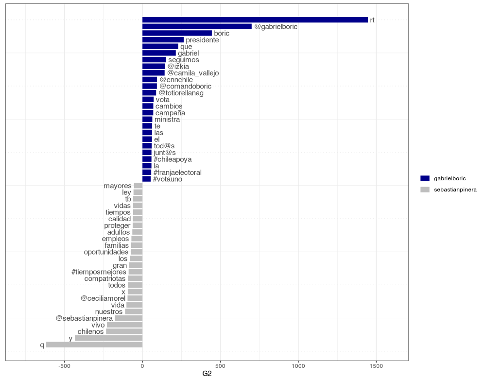

By Rodrigo Esteves de Lima Lopes *University of Campinas* [rll307\@unicamp.br](mailto:rll307@unicamp.br)

------------------------------------------------------------------------

# Quanteda

# Introduction

[Quanteda](https://quanteda.io/) is a package for managing and analyse text quantitatively. It is quite easy to use and will bring us a number of interesting functions.

## You will need:

1.  The package [`Quanteda`](https://quanteda.io/), `quanteda.textplots` and `quanteda.textstats`, which can be installed using [RStudio](http://www.sthda.com/english/wiki/installing-and-using-r-packages)
2.  The package `rtweet`, which we installed for our [first Twitter tutorial](05_rtweet_E1).
3.  `Ggplot2` for viewing some graphics, which we installed for our [first Twitter tutorial](05_rtweet_E1).

``` r
# Running the packages
library(quanteda)
library(quanteda.textplots)
library(quanteda.textstats)
```

## Data

We are going to use the same data we have used in the previous tutorial

# Making some comparissions

## Corpus creation

Our first step is to use `Quanteda` to create corpus. A corpus in this context is an formal variable thata allows the text to interact with the package.

``` r
presidents.C <- corpus(presidents)
```

Our next step is to create a corpus for each of the presidents we have scraped the timeline

``` r
gabrielboric.c <- corpus_subset(presidents.C, screen_name == "gabrielboric")
sebastianpinera.c <- corpus_subset(presidents.C, screen_name == "sebastianpinera")
```

# Tokenisation

Next we need to tokenise our data, so the package can identify each word as a unity of analysis.

``` r
 # Boric
gabrielboric.toc <- tokens(gabrielboric.c,
                   remove_punct = TRUE,
                   remove_symbols = TRUE,
                   remove_numbers = TRUE,
                   verbose = TRUE)
gabrielboric.toc <- tokens_remove(gabrielboric.toc,
                          stopwords("es"),
                          valuetype = "fixed",
                          verbose = TRUE
                          ) %>% tokens_tolower()

#Piñeda
sebastianpinera.toc <- tokens(sebastianpinera.c,
                   remove_punct = TRUE,
                   remove_symbols = TRUE,
                   remove_numbers = TRUE,
                   verbose = TRUE)

sebastianpinera.toc <- tokens_remove(sebastianpinera.toc,
                          stopwords("es"),
                          valuetype = "fixed",
                          verbose = TRUE
                          ) %>% tokens_tolower()
```

# Concordances

`Quanteda` allows us to make concordances. Let us see a little of `Kwic`.

``` r
kwic(gabrielboric.toc,"chile") |> View()
kwic(sebastianpinera.toc,"chile") |> View()
```

# Bigrams

How about to analyse how bigrams are in each corpus? This will help us to understand the general aboutness of the texts.

``` r
gabrielboric.col <- textstat_collocations(gabrielboric.toc, method = "lambda",
                                  size = 2,
                                  min_count = 2,
                                  smoothing = 0.5,
                                  tolower = TRUE,
                                  verbose = TRUE)

sebastianpinera.col <- textstat_collocations(sebastianpinera.toc, method = "lambda",
                                  size = 2,
                                  min_count = 2,
                                  smoothing = 0.5,
                                  tolower = TRUE,
                                  verbose = TRUE)
```

Let us see each of them:

``` r
View(gabrielboric.col)
View(sebastianpinera.col)
```

# Comparing and Plotting

Our nest step is to compare the candidates.

``` r
presidents.toc <- tokens(presidents.C,
                  remove_punct = TRUE,
                  remove_symbols = TRUE,
                  remove_numbers = TRUE,
                  verbose = TRUE) %>%
  tokens_remove(pattern = my.stopwords) %>%
  tokens_tolower() %>% 
  tokens_group(groups = screen_name)

dfm.pres <- dfm(presidents.toc, verbose = TRUE)
```

Plotting:

``` r
textstat_keyness(dfm.pres,
                 target = "gabrielboric",
                 measure = "lr") |> 
  textplot_keyness(n= 25)
```


