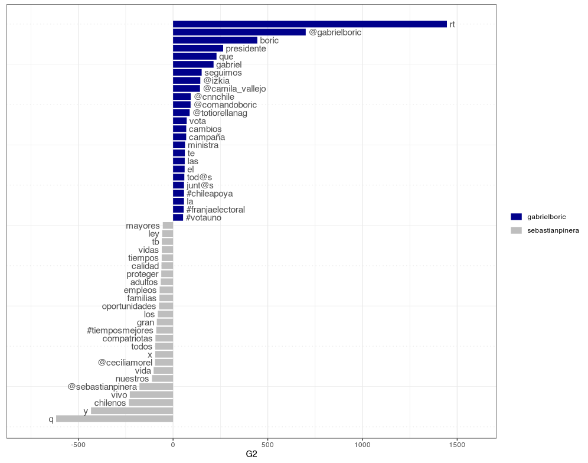

By Rodrigo Esteves de Lima Lopes *Campinas University* [rll307\@unicamp.br](mailto:rll307@unicamp.br)

------------------------------------------------------------------------

# Plotting

# Introduction

Our may objective here is to plot the results we collected last script. The grammar of plotting might be a bit overwhelming, but keep in mind it is just a small introduction.

In this tutorial we use [`ggplot2`](https://ggplot2.tidyverse.org/index.html), a package for plotting in R. Other packages should do the job, but `ggplot2` is the most popular across `R` users.

Plotting:

``` r
presidents.toc <- tokens(presidents.C,
                  remove_punct = TRUE,
                  remove_symbols = TRUE,
                  remove_numbers = TRUE,
                  verbose = TRUE) %>%
  tokens_remove(pattern = my.stopwords) %>%
  tokens_tolower() %>% 
  tokens_group(groups = screen_name)

dfm.pres <- dfm(presidents.toc, verbose = TRUE)
```

``` r
textstat_keyness(dfm.pres,
                 target = "gabrielboric",
                 measure = "lr") |> 
  textplot_keyness(n= 25)
```


