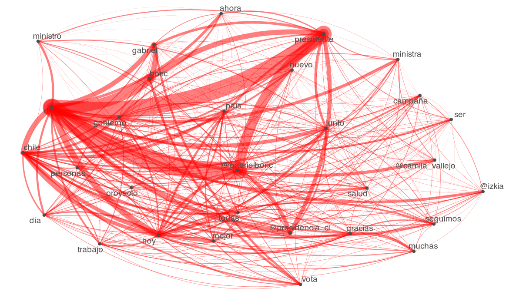
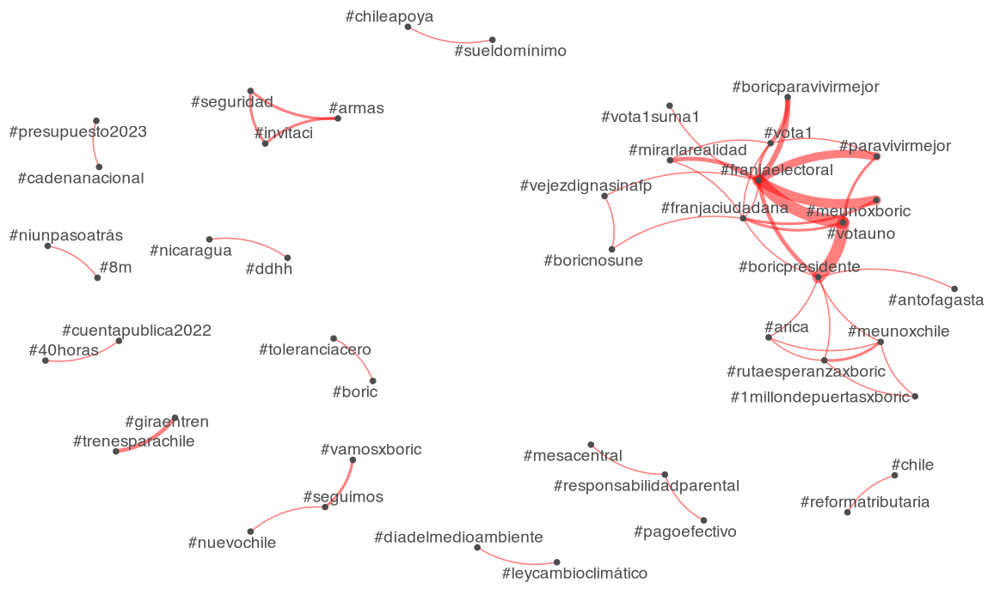
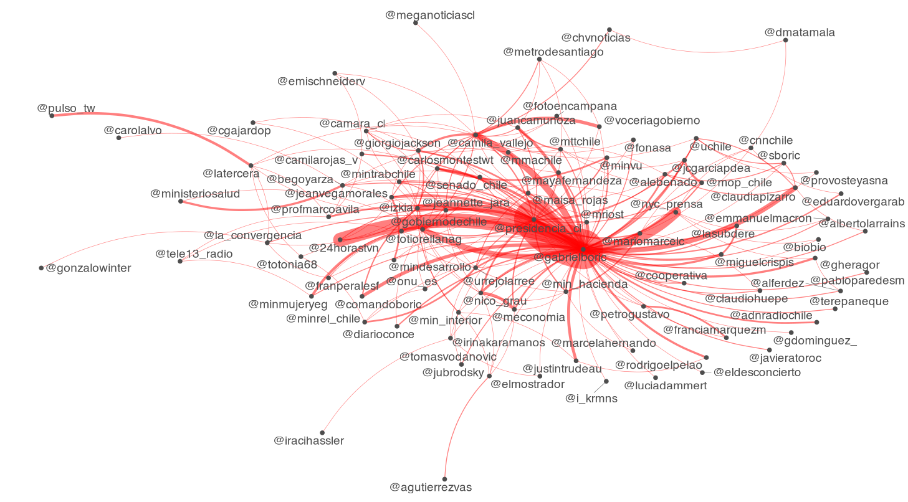
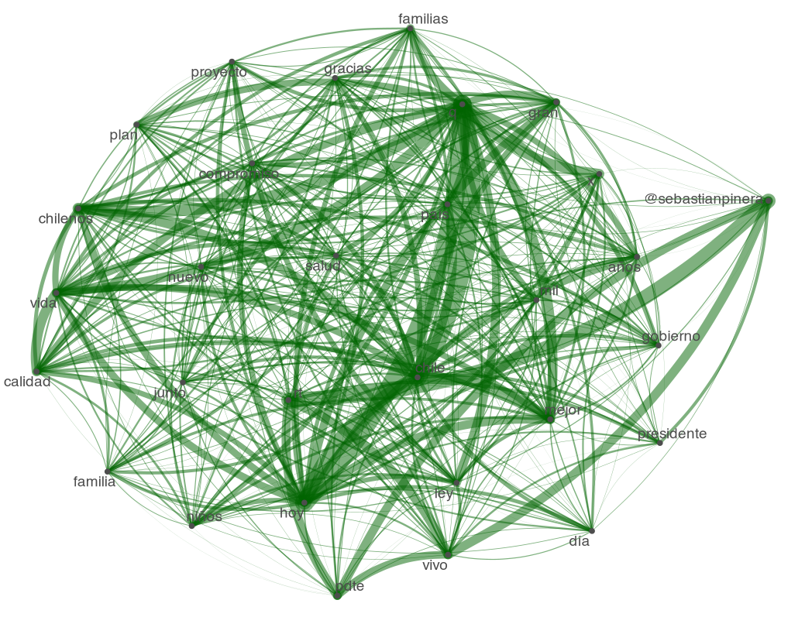
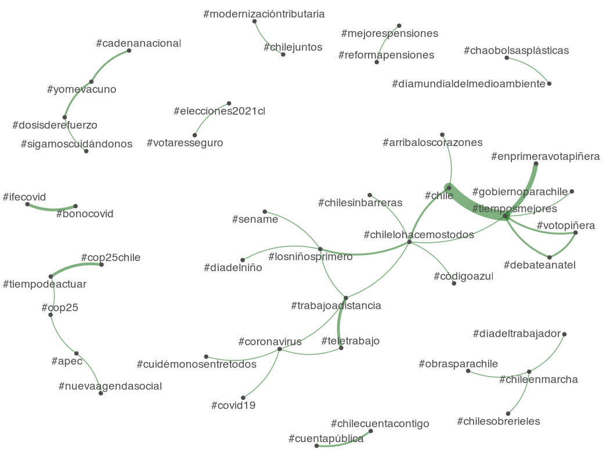
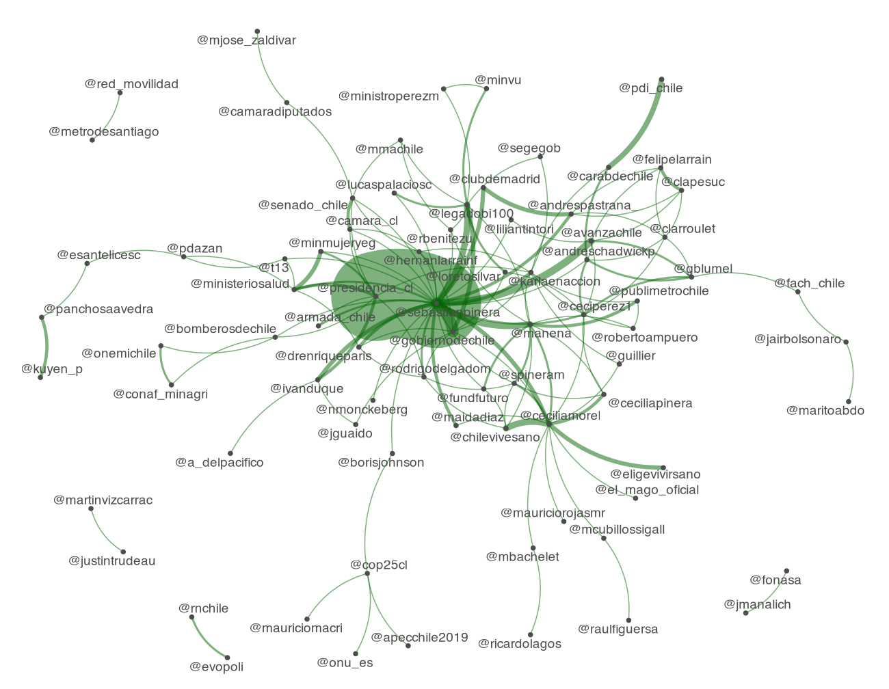

By Rodrigo Esteves de Lima Lopes *University of Campinas* [rll307\@unicamp.br](mailto:rll307@unicamp.br)

------------------------------------------------------------------------

# Some twitter analysis with R

## Introduction

In this tutorial we are going to perform some deeper analysis of Chilean presidents, searching for patterns of words, `@handles` and `#hashtags` patterns. The analysis brings some extra comments on the concepts behind the codes.

# Packages

In this tutorial, the following packes will be necessary:

``` r
library(quanteda)
library(quanteda.textplots)
library(quanteda.textstats)
```

-   **Quanteda:** for text processing

-   **quanteda.textplots:** for network plotting

-   **quanteda.textstats**: for some underlying calculations

# The analysis

## Gabriel Boric

### Words

Out first step is to take our corpus tokens and create a DFM (document-feature matrix). A DFM tells us the frequency of features in a set of documents:


``` r
gabrielboric.dfm <- dfm(gabrielboric.toc)
```

A consequence of working with small texts is a lot of zeros in our matrix, a very sparse data set.

Unfortunately, due to time and processing issues we will not analyse all words in any candidates tweets, only a small sample. So it makes sense to sample the most frequent words:

``` r
gabrielboric.top <- names(topfeatures(gabrielboric.dfm, 30))
```

Then, we are going to create a FCM (Feature Co-Occurrence Matrix) tells us how each feature co-occurs in a corpus:


``` r
gabrielboric.fcm <-fcm(gabrielboric.dfm)
```

Our next step is to select the most frequent elements in out matrix, using the `gabrielboric.top` variable we just created.

``` r
gabrielboric.top.fcm <- fcm_select(gabrielboric.fcm, pattern = gabrielboric.top)
```

Finally we plot the network:

``` r
textplot_network(gabrielboric.top.fcm, 
                 min_freq = 0.1, 
                 edge_alpha = 0.5, 
                 edge_size = 5,
                 edge_color = 'red')
```



### Hashtags

Now we are going to analyse the hashtags. Our first step is to select only the `#` pattern and create a DFM.

``` r
gabrielboric.tags <- dfm_select(gabrielboric.dfm, pattern = ("#*"))
```

Selecting the 100 most frequent hashtags:

``` r
gabrielboric.tags.top <- names(topfeatures(gabrielboric.tags, 100))
```

Another FCM, but now hashtag exclusive:

``` r
gabrielboric.tags.fcm <- fcm(gabrielboric.tags)
```

Selecting the top hashtags

``` r
gabrielboric.top.hash <- fcm_select(gabrielboric.tags.fcm, pattern = gabrielboric.tags.top)
```

Then we plot:

``` r
textplot_network(gabrielboric.top.hash, 
                 min_freq = 0.1, 
                 edge_alpha = 0.5, 
                 edge_size = 5,
                 edge_color = 'red')
```



### Handles

If we wish, we can do the same with Twitter user names (or handles) in order to analyse Gabriel Boric's most quoted and re-tweeted users. We have only to substitute `#*` for `@*`. Here is the code:

``` r
#Selecting the handles
gabrielboric.handle <- dfm_select(gabrielboric.dfm, pattern = ("@*"))
gabrielboric.handle.top <- names(topfeatures(gabrielboric.handle, 100))

# Now let us construct a FCM
gabrielboric.handle.fcm <- fcm(gabrielboric.handle)

# Let us make a FCM only with the top handles

gabrielboric.top.handles <- fcm_select(gabrielboric.handle.fcm, pattern = gabrielboric.handle.top)

textplot_network(gabrielboric.top.handles, 
                 min_freq = 0.1, 
                 edge_alpha = 0.5, 
                 edge_size = 5,
                 edge_color = 'red')
```

The result is:



We can save this data form using with other software than R.

``` r
gabrielboric.hash.matrix <- convert(gabrielboric.top.hash,to = "matrix")
write.csv(gabrielboric.hash.matrix,"BoricHash.csv")
gabrielboric.handles.matrix <- convert(gabrielboric.top.handles,to = "matrix")
write.csv(gabrielboric.handles.matrix,"BoricHandle.csv")
```

Now let us do the same for Sebastian Piñera.

## Sebastian Piñera

``` r
#creating a general DFM
sebastianpinera.dfm <- dfm(sebastianpinera.toc)

#Selecting the most frequent words
sebastianpinera.top <- names(topfeatures(sebastianpinera.dfm, 30))
#Selecting the most common words to print
sebastianpinera.fcm <-fcm(sebastianpinera.dfm)
sebastianpinera.top.fcm <- fcm_select(sebastianpinera.fcm, pattern = sebastianpinera.top)

textplot_network(sebastianpinera.top.fcm, 
                 min_freq = 0.1, 
                 edge_alpha = 0.5, 
                 edge_size = 5,
                 edge_color = 'darkgreen')

#Selecting the hashtag
sebastianpinera.tags <- dfm_select(sebastianpinera.dfm, pattern = ("#*"))
sebastianpinera.tags.top <- names(topfeatures(sebastianpinera.tags, 100))

# Now let us construct a FCM
sebastianpinera.tags.fcm <- fcm(sebastianpinera.tags)

# Let us make a FCM only with the top hashtags

sebastianpinera.top.hash <- fcm_select(sebastianpinera.tags.fcm, pattern = sebastianpinera.tags.top)

textplot_network(sebastianpinera.top.hash, 
                 min_freq = 0.1, 
                 edge_alpha = 0.5, 
                 edge_size = 5,
                 edge_color = 'darkgreen')

#Selecting the handles
sebastianpinera.handle <- dfm_select(sebastianpinera.dfm, pattern = ("@*"))
sebastianpinera.handle.top <- names(topfeatures(sebastianpinera.handle, 100))

# Now let us construct a FCM
sebastianpinera.handle.fcm <- fcm(sebastianpinera.handle)

# Let us make a FCM only with the top handles

sebastianpinera.top.handles <- fcm_select(sebastianpinera.handle.fcm, pattern = sebastianpinera.handle.top)

textplot_network(sebastianpinera.top.handles, 
                 min_freq = 0.1, 
                 edge_alpha = 0.5, 
                 edge_size = 5,
                 edge_color = 'darkgreen')

# SAVING AS A MATRIX
sebastianpinera.hash.matrix <- convert(sebastianpinera.top.hash,to = "matrix")
write.csv(sebastianpinera.hash.matrix,"Sebastian PineraHash.csv")

sebastianpinera.handles.matrix <- convert(sebastianpinera.top.handles,to = "matrix")
write.csv(sebastianpinera.handles.matrix,"SebastianPineraHandle.csv")
```






