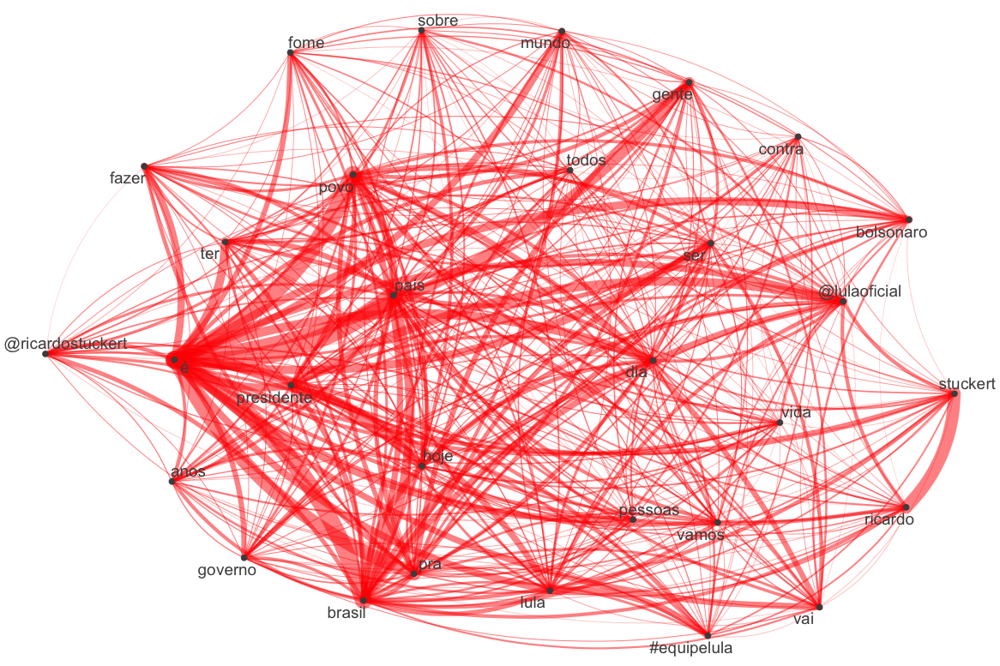
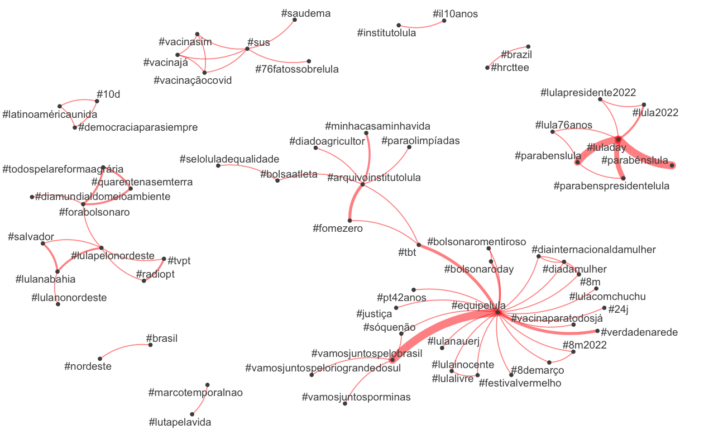
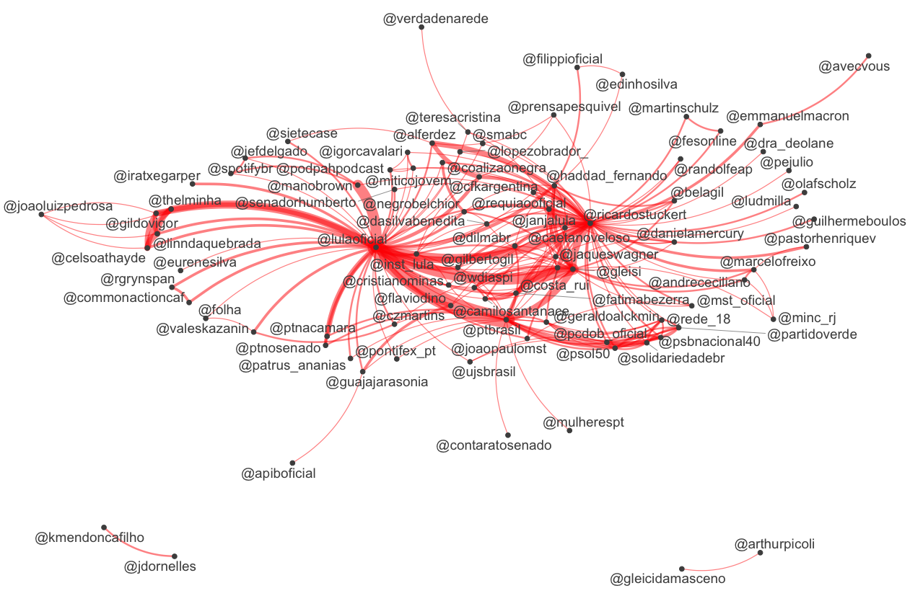
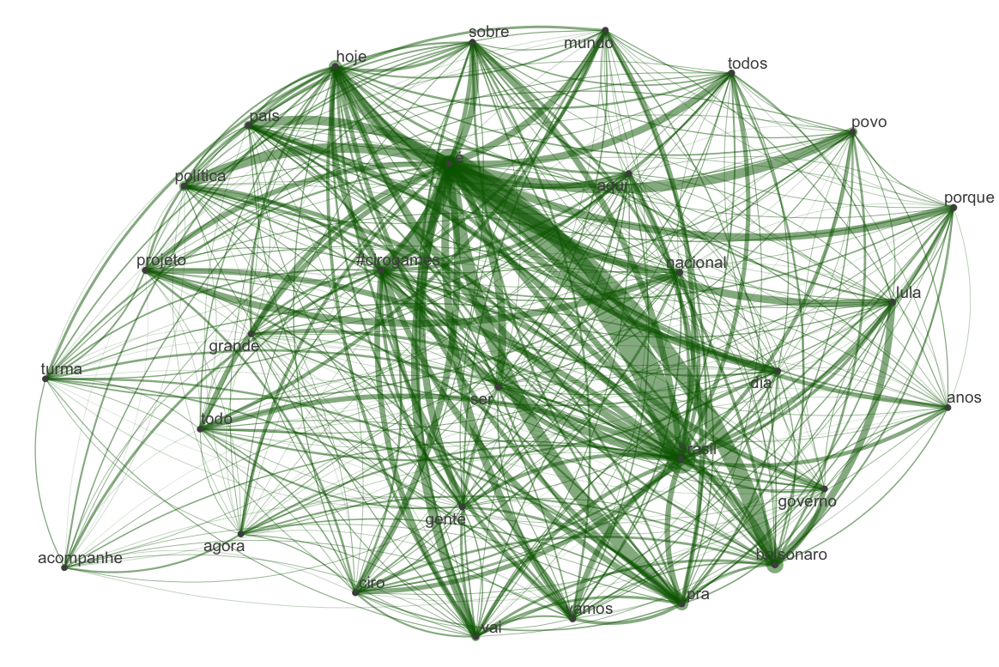
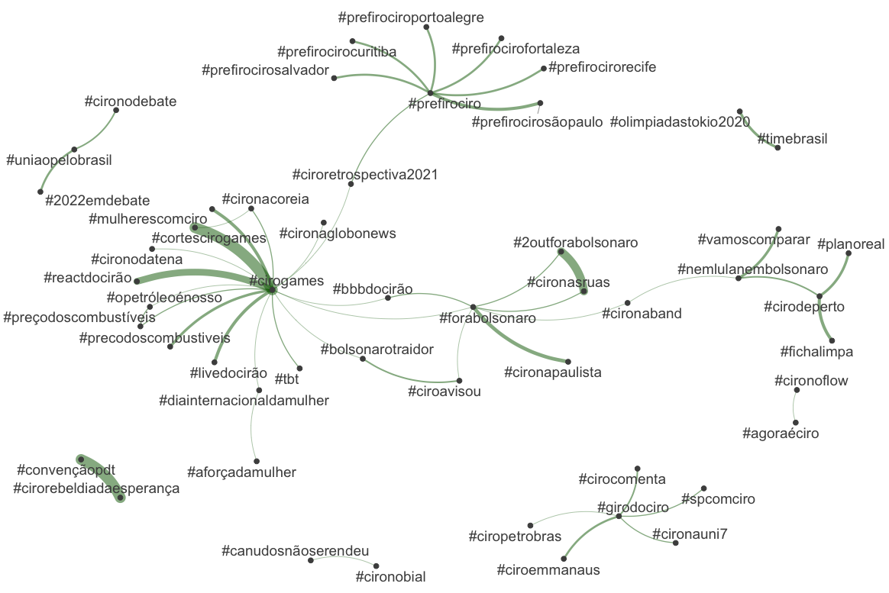
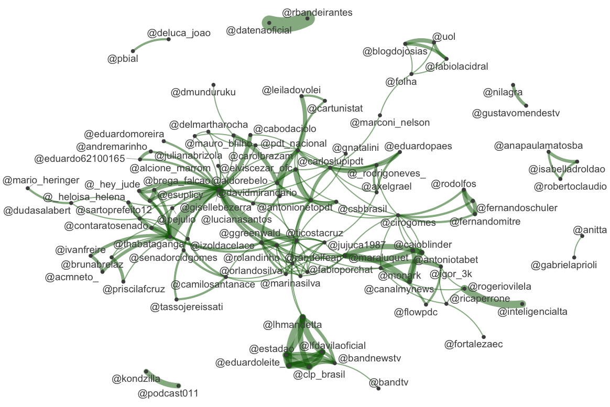
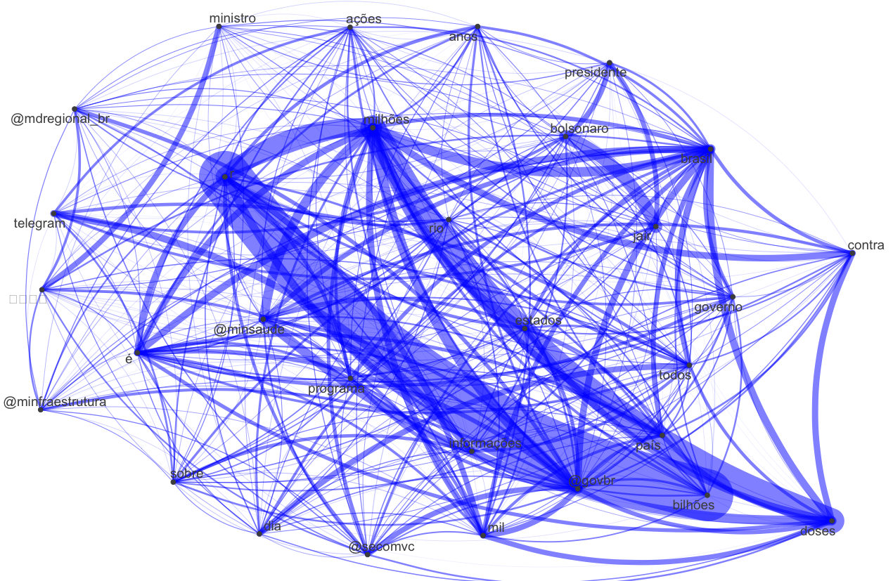
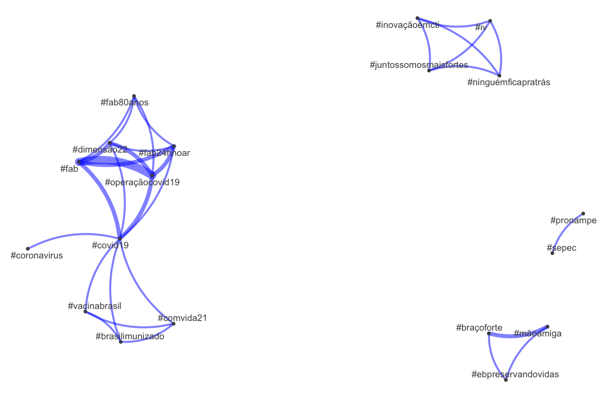
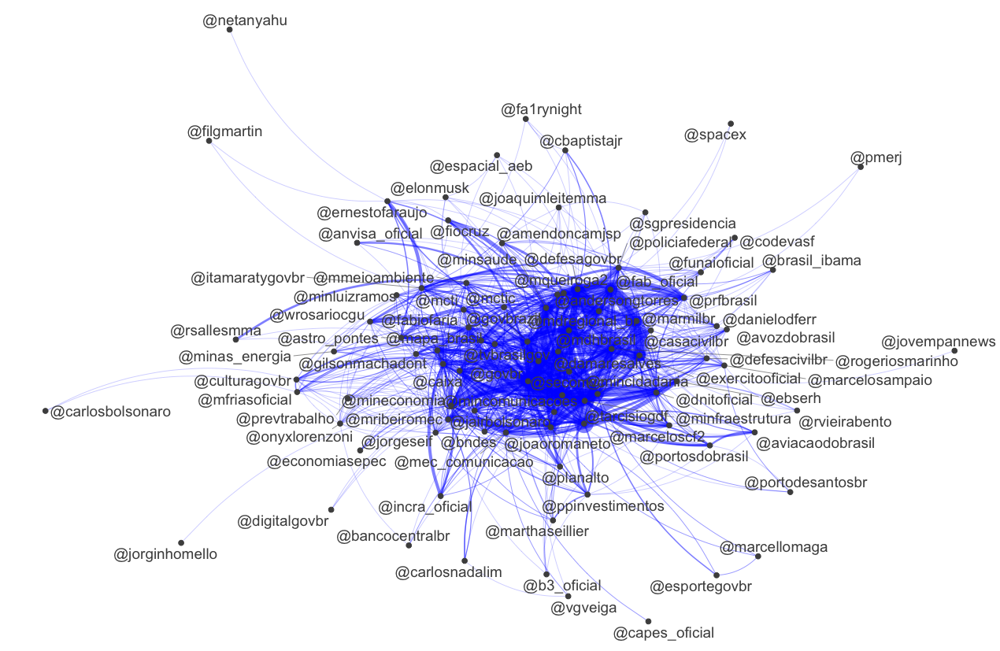

By Rodrigo Esteves de Lima Lopes *University of Campinas* [rll307\@unicamp.br](mailto:rll307@unicamp.br)

------------------------------------------------------------------------

# Some twitter analysis with R

## Introduction

In this tutorial we are going to perform some deeper analysis of Brazilian presidential pre-candidates, searching for patterns of words, `@handles` and `#hashtags` patterns. The first analysis brings some extra comments on the concepts behind the codes, while the following just extends the same analysis to the other two pre-candidates.

# Packages

In this tutorial, the following packes will be necessary:

``` r
library(quanteda)
library(quanteda.textplots)
library(quanteda.textstats)
```

-   **Quanteda:** for text processing

-   **quanteda.textplots:** for network plotting

-   **quanteda.textstats**: for some underlying calculations

# The analysis

## Lula

### Words

Out first step is to take our corpus tokens and create a DFM (document-feature matrix). A DFM tells us which features occurs more frequently in a set of documents:


``` r
Lula.dfm <- dfm(lula.toc)
```

A consequence of working with small texts is a lot of zeros in our matrix, resulting in a very sparse set of data.

Unfortunately, due to time and processing issues we will not analyse all words in any candidates tweets, only a small sample. So it makes sense to sample the most frequent words:

``` r
Lula.top <- names(topfeatures(Lula.dfm, 30))
```

Then, we are going to create a FCM (Feature Co-Occurrence Matrix) tells us how each feature co-occurs in a corpus:


``` r
Lula.fcm <-fcm(Lula.dfm)
```

Our next step is to select the most frequent elements in out matrix, using the `Lula.top` variable we just created.

``` r
Lula.top.fcm <- fcm_select(Lula.fcm, pattern = Lula.top)
```

Finally we plot the network:

``` r
textplot_network(Lula.top.fcm, 
                 min_freq = 0.1, 
                 edge_alpha = 0.5, 
                 edge_size = 5,
                 edge_color = 'red')
```



### Hashtags

Now we are going to analyse the hashtags. Our first step is to select only the `#` pattern and create a DFM.

``` r
Lula.tags <- dfm_select(Lula.dfm, pattern = ("#*"))
```

Selecting the 100 most frequent hashtags:

``` r
Lula.tags.top <- names(topfeatures(Lula.tags, 100))
```

Another FCM, but now hashtag exclusive:

``` r
Lula.tags.fcm <- fcm(Lula.tags)
```

Selecting the top hashtags

``` r
Lula.top.hash <- fcm_select(Lula.tags.fcm, pattern = Lula.tags.top)
```

Then we plot:

``` r
textplot_network(Lula.top.hash, 
                 min_freq = 0.1, 
                 edge_alpha = 0.5, 
                 edge_size = 5,
                 edge_color = 'red')
```



### Handles

If we wish, we can do the same with Twitter user names (or handles) in order to analyse Lula's most quoted and re-tweeted users. We have only to substitute `#*` for `@*`. Here is the code:

``` r
#Selecting the handles
Lula.handle <- dfm_select(Lula.dfm, pattern = ("@*"))
Lula.handle.top <- names(topfeatures(Lula.handle, 100))

# Now let us construct a FCM
Lula.handle.fcm <- fcm(Lula.handle)

# Let us make a FCM only with the top handles

Lula.top.handles <- fcm_select(Lula.handle.fcm, pattern = Lula.handle.top)

textplot_network(Lula.top.handles, 
                 min_freq = 0.1, 
                 edge_alpha = 0.5, 
                 edge_size = 5,
                 edge_color = 'red')
```

The result is:



We can save this data form using with other software than R.

``` r
Lula.hash.matrix <- convert(Lula.top.hash,to = "matrix")
write.csv(Lula.hash.matrix,"LulaHash.csv")
Lula.handles.matrix <- convert(Lula.top.handles,to = "matrix")
write.csv(Lula.handles.matrix,"LulaHandle.csv")
```

Now let us do the same for Ciro Gomes e Jair Bolsonaro.

## Ciro Gomes

``` r
#creating a general DFM
Ciro.dfm <- dfm(ciro.toc)

#Selecting the most frequent words
Ciro.top <- names(topfeatures(Ciro.dfm, 30))
#Selecting the most common words to print
Ciro.fcm <-fcm(Ciro.dfm)
Ciro.top.fcm <- fcm_select(Ciro.fcm, pattern = Ciro.top)

textplot_network(Ciro.top.fcm, 
                 min_freq = 0.1, 
                 edge_alpha = 0.5, 
                 edge_size = 5,
                 edge_color = 'darkgreen')

#Selecting the hashtag
Ciro.tags <- dfm_select(Ciro.dfm, pattern = ("#*"))
Ciro.tags.top <- names(topfeatures(Ciro.tags, 100))

# Now let us construct a FCM
Ciro.tags.fcm <- fcm(Ciro.tags)

# Let us make a FCM only with the top hashtags

Ciro.top.hash <- fcm_select(Ciro.tags.fcm, pattern = Ciro.tags.top)

textplot_network(Ciro.top.hash, 
                 min_freq = 0.1, 
                 edge_alpha = 0.5, 
                 edge_size = 5,
                 edge_color = 'darkgreen')

#Selecting the handles
Ciro.handle <- dfm_select(Ciro.dfm, pattern = ("@*"))
Ciro.handle.top <- names(topfeatures(Ciro.handle, 100))

# Now let us construct a FCM
Ciro.handle.fcm <- fcm(Ciro.handle)

# Let us make a FCM only with the top handles

Ciro.top.handles <- fcm_select(Ciro.handle.fcm, pattern = Ciro.handle.top)

textplot_network(Ciro.top.handles, 
                 min_freq = 0.1, 
                 edge_alpha = 0.5, 
                 edge_size = 5,
                 edge_color = 'darkgreen')

# SAVING AS A MATRIX
Ciro.hash.matrix <- convert(Ciro.top.hash,to = "matrix")
write.csv(Ciro.hash.matrix,"CiroHash.csv")

Ciro.handles.matrix <- convert(Ciro.top.handles,to = "matrix")
write.csv(Ciro.handles.matrix,"CiroHandle.csv")
```

The visual results are:







## Jair Bolsonaro

``` r
#creating a general DFM
JB.dfm <- dfm(JB.toc)

#Selecting the most frequent words
JB.top <- names(topfeatures(JB.dfm, 30))
#Selecting the most common words to print
JB.fcm <-fcm(JB.dfm)
JB.top.fcm <- fcm_select(JB.fcm, pattern = JB.top)

textplot_network(JB.top.fcm, 
                 min_freq = 0.1, 
                 edge_alpha = 0.5, 
                 edge_size = 5,
                 edge_color = 'blue')

#Selecting the hashtag
JB.tags <- dfm_select(JB.dfm, pattern = ("#*"))
JB.tags.top <- names(topfeatures(JB.tags, 100))

# Now let us construct a FCM
JB.tags.fcm <- fcm(JB.tags)

# Let us make a FCM only with the top hashtags

JB.top.hash <- fcm_select(JB.tags.fcm, pattern = JB.tags.top)

textplot_network(JB.top.hash, 
                 min_freq = 0.1, 
                 edge_alpha = 0.5, 
                 edge_size = 5,
                 edge_color = 'blue')

#Selecting the handles
JB.handle <- dfm_select(JB.dfm, pattern = ("@*"))
JB.handle.top <- names(topfeatures(JB.handle, 100))

# Now let us construct a FCM
JB.handle.fcm <- fcm(JB.handle)

# Let us make a FCM only with the top handles

JB.top.handles <- fcm_select(JB.handle.fcm, pattern = JB.handle.top)

textplot_network(JB.top.handles, 
                 min_freq = 0.1, 
                 edge_alpha = 0.5, 
                 edge_size = 5,
                 edge_color = 'blue')

# SAVING AS A MATRIX
JB.hash.matrix <- convert(JB.top.hash,to = "matrix")
write.csv(JB.hash.matrix,"JBHash.csv")

JB.handles.matrix <- convert(JB.top.handles,to = "matrix")
write.csv(JB.handles.matrix,"JBHandle.csv")
```

The visual result is:






