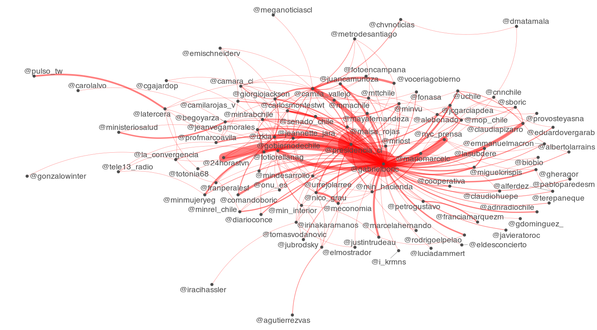
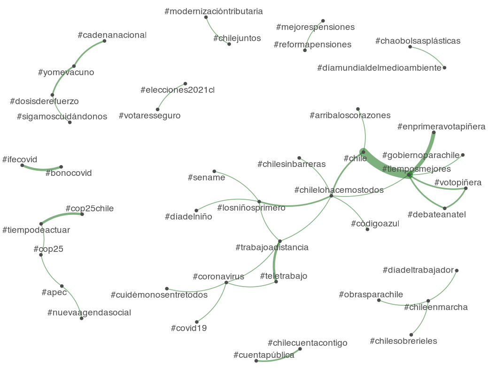

By Rodrigo Esteves de Lima Lopes *Campinas University* [rll307\@unicamp.br](mailto:rll307@unicamp.br)

------------------------------------------------------------------------

# Plotting

# Introduction

Our may objective here is to plot the results we collected last script. The grammar of plotting might be a bit overwhelming, but keep in mind it is just a small introduction.

In this tutorial we use [`ggplot2`](https://ggplot2.tidyverse.org/index.html), a package for plotting in R. Other packages should do the job, but `ggplot2` is the most popular across `R` users.

Plotting:

## Boric
``` r
textplot_network(gabrielboric.top.fcm, 
                 min_freq = 0.1, 
                 edge_alpha = 0.5, 
                 edge_size = 5,
                 edge_color = 'red')
```


``` r
textplot_network(gabrielboric.top.hash, 
                 min_freq = 0.1, 
                 edge_alpha = 0.5, 
                 edge_size = 5,
                 edge_color = 'red')
```


``` r
textplot_network(gabrielboric.top.handles, 
                 min_freq = 0.1, 
                 edge_alpha = 0.5, 
                 edge_size = 5,
                 edge_color = 'red')
```




## Piñeda

```r
textplot_network(sebastianpinera.top.fcm, 
                 min_freq = 0.1, 
                 edge_alpha = 0.5, 
                 edge_size = 5,
                 edge_color = 'darkgreen')
```


```r
textplot_network(sebastianpinera.top.hash, 
                 min_freq = 0.1, 
                 edge_alpha = 0.5, 
                 edge_size = 5,
                 edge_color = 'darkgreen')
```



```r
textplot_network(sebastianpinera.top.handles, 
                 min_freq = 0.1, 
                 edge_alpha = 0.5, 
                 edge_size = 5,
                 edge_color = 'darkgreen')
```

